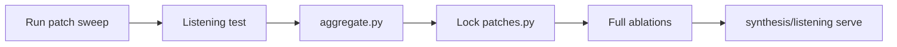

# Experiments

Offline parameter sweeps and tuning runs. Experiment **code and config** live here; large **audio outputs** live on deepfreeze with in-repo symlinks.

**Goal:** pick **per-category** winners (piano, strings, brass, drums, …) for Slakh patch pools — not a single global setting for all instruments.

**Tuning docs:** [`TUNING.md`](TUNING.md) — shared methodology, staged Slakh plan, result-recording conventions.

> **Note:** SA3 realify and `experiments/preset_sweep` were removed. Patch sweep + ablation listening remain.

## Collaborator setup (ICASSP pilots)

**→ Copy/paste for a new machine with Deep Freeze: [`COLLABORATOR_SETUP.md`](COLLABORATOR_SETUP.md)**

After clone + `uv sync`:

```bash
uv run python -m experiments.setup_pilots
```

That configures `.env` checks, deepfreeze symlinks, YourMT3, and stream-music-gen in one shot.

Individual setups (same machine, later):

```bash
uv run python -m experiments.transcription.setup_yourmt3
uv run python -m experiments.streamgen.setup_streamgen
```

## Layout

```
experiments/
├── README.md
├── COLLABORATOR_SETUP.md     # Slack-ready Deep Freeze pilot setup
├── setup_pilots.py           # one-command YourMT3 + StreamGen
├── TUNING.md                 # methodology for patch tuning
├── probe_stems.yaml          # shared probe set (24 stems: 3 per category × 8)
├── listening/                # sweep listening-test server (port 8766; patch)
├── listening_shared/         # shared 0–100 slider UI + clip helpers
├── ablation_listening/       # Test 1: dataset ablation comparison (port 8767)
├── model_listening/          # Test 2: SAO downstream comparison (port 8768)
├── separation/               # Hybrid Demucs matched-budget PoC
├── sao/                      # Stable Audio Open fine-tune PoC (optional generative eval)
├── transcription/            # Multi-instrument AMT scale-up (YourMT3)
├── streamgen/                # Streaming accompaniment (stream-music-gen)
└── patch_sweep/              # Slakh: soundfonts, FX, program pools
    └── soundfonts.yaml       # candidate GM banks (phase 1)
```

Paper/Blog pilots for transcription and StreamGen: see each package `README.md` and `docs/blog/`.

## Setup

After clone, create dev artifact symlinks (includes sweep outputs):

```bash
uv run python -m shared.setup_symlinks
```

## Workflow



### Stage 1 — Run sweeps

```bash
# Patch pools (CPU; define PATCH_POOLS first)
uv run python -m experiments.patch_sweep.sweep -j 8
```

### Stage 2 — Listening test

```bash
uv run python -m experiments.listening.serve --sweep patch
```

Open [http://127.0.0.1:8766](http://127.0.0.1:8766). Rate each blinded variant on content (1–5) and realism (1–5). Export JSON when done.

### Stage 3 — Aggregate winners

```bash
uv run python -m experiments.listening.aggregate \
  --sweep patch \
  --responses responses_patch.json \
  --output experiments/patch_sweep/results_notes.md
```

Update production configs from results.

### Stage 4 — Validation ablation comparison

```bash
uv run python -m synthesis.listening.serve
```

Compare locked configs across ablations (port 8765).

### Stage 5 — Formal listening tests (0–100 scale)

**Test 1 — dataset ablation:**

```bash
uv run python -m experiments.ablation_listening.prepare_clips
uv run python -m experiments.ablation_listening.serve --host 0.0.0.0 --port 8767
# ngrok http 8767
uv run python -m experiments.ablation_listening.aggregate \
  --responses experiments/ablation_listening/output/responses/responses_*.json \
  --output experiments/ablation_listening/output/results_notes.md
```

**Test 2 — SAO downstream:** see [`model_listening/README.md`](model_listening/README.md) (scaffold; ICASSP PoC uses objective FAD/CLAP instead).

## ICASSP PoC (objective, no listening)

- [`separation/`](separation/) — Hybrid Demucs × Slakh / sPDMX-BDGP (SI-SDR)
- [`sao/`](sao/) — SAO fine-tunes: Slakh / sPDMX-BDGP / sPDMX-full (FAD + CLAP)

Shared UI and ngrok notes: [`listening_shared/README.md`](listening_shared/README.md).

- [`TUNING.md`](TUNING.md) — overall methodology (start here)
- [`patch_sweep/GUIDE.md`](patch_sweep/GUIDE.md) — **step-by-step Slakh tuning runbook**
- [`patch_sweep/soundfonts.yaml`](patch_sweep/soundfonts.yaml) — candidate soundfont catalog
- [`listening/README.md`](listening/README.md)
